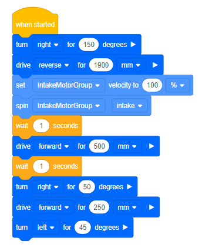
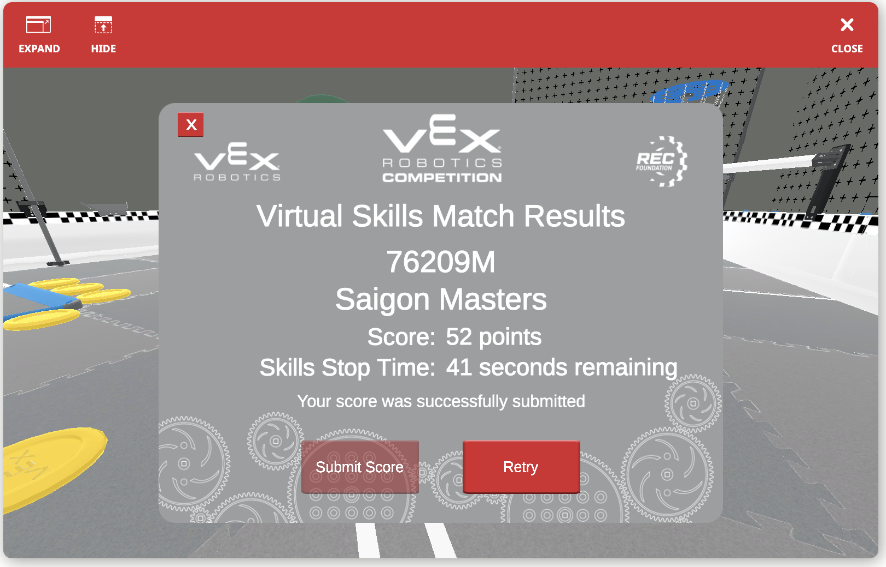

# Team 76209M - The Masters

Members are probably still to be determined, but we got a virtual team and Thai is programming for them.

Here is the starting point:

## Blockcode

Easy 31 points.



## Python

``` py
myVariable = 0

def when_started1():
    global myVariable
    drivetrain.turn_for(RIGHT, 150, DEGREES, wait=True)
    drivetrain.drive_for(REVERSE, 1900, MM, wait=True)
    intake_motor_group.set_velocity(100, PERCENT)
    intake_motor_group.spin(REVERSE)
    wait(1, SECONDS)
    drivetrain.drive_for(FORWARD, 500, MM, wait=True)
    wait(1, SECONDS)
    drivetrain.turn_for(RIGHT, 50, DEGREES, wait=True)
    drivetrain.drive_for(FORWARD, 250, MM, wait=True)
    drivetrain.turn_for(LEFT, 45, DEGREES, wait=True)

vr_thread(when_started1)
```

## Pick up more

By September 16th we're up to 52 points, standing on 4 tiles in the end



And here is the code

``` py
#region VEXcode Generated Robot Configuration
import math
import random
from vexcode_vrc import *
from vexcode_vrc.events import get_Task_func
  
# constructors

drivetrain = Drivetrain()
brain = Brain()
bottom_distance = Distance("BottomDistance", 18)
roller_optical = Optical("RollerOptical", 2)
gps = GPS("GPS", 3)
intake_motor_group = Motor("IntakeMotorGroup", 10)
bottom_line_tracker = LineTracker("BottomLineTracker", 22)
middle_line_tracker = LineTracker("MiddleLineTracker", 23)
top_line_tracker = LineTracker("TopLineTracker", 24)
#endregion VEXcode Generated Robot Configuration

# --------------------------------------------------
# 
# 	Project:            VEXcode Project
#	Author:             Matthias Kreier
#	Created:            2022/09/16
#	Description:        VEXcode V5 Python Project
#   Starting Position:  C
#   Preload:            2 disks
# 
# --------------------------------------------------

# Library imports
from vexcode_vrc import *

myVariable = 0

# Add project code in "main"
def main():
    global myVariable
    drivetrain.turn_for(RIGHT, 149, DEGREES, wait=True)
    drivetrain.drive_for(REVERSE, 1895, MM, wait=True)
    intake_motor_group.set_velocity(95, PERCENT)
    intake_motor_group.spin(REVERSE)
    wait(1, SECONDS)
    drivetrain.drive_for(FORWARD, 500, MM, wait=True)
    wait(1, SECONDS)
    drivetrain.turn_for(RIGHT, 50, DEGREES, wait=True)
    drivetrain.drive_for(FORWARD, 250, MM, wait=True)
    drivetrain.turn_for(LEFT, 45, DEGREES, wait=True)
    wait(3, SECONDS)
    drivetrain.drive_for(FORWARD, 250, MM, wait=True)
    wait(3, SECONDS)
    drivetrain.drive_for(FORWARD, 100, MM, wait=True)
    drivetrain.turn_for(LEFT, 30, DEGREES, wait=True)
    drivetrain.drive_for(REVERSE, 195, MM, wait=True)

# VR threads — Do not delete
vr_thread(main)
```
