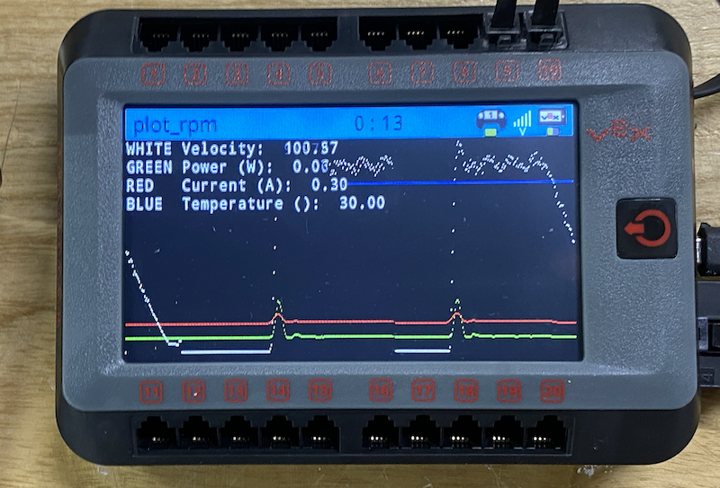

# 76209T - Training Robot

This X-drive robot with GPS is intended for improving the programming skills and give students some ideas for a better robot. Inspiration is taken from:

- 98377G [Video reveal](https://youtu.be/Mdag3BO5-SI) and [Instagram](https://www.instagram.com/98377g_tigris_ex_machina/?hl=en)
- 515R [Video Flywheel Speed Graph](https://youtu.be/8TGn9SbxiQs)
- [Comparison different drives for VEX](https://youtu.be/Py14YTHCth0)
- 4082B [Reveal video](https://youtu.be/s1jZD31WGI8) winner of MOA

## Plot rpm and power consumption

Taking inspiration from team 515R and their C++ programm of plotting rpm and power versus time for the spin up of their flywheel we documented our systems as well:



The code reads:

``` py
#region VEXcode Generated Robot Configuration
from vex import *
import urandom

# Brain should be defined by default
brain=Brain()

# Robot configuration code
controller_1 = Controller(PRIMARY)
flywheel_motor_a = Motor(Ports.PORT9, GearSetting.RATIO_6_1, False)
flywheel_motor_b = Motor(Ports.PORT10, GearSetting.RATIO_6_1, True)
flywheel = MotorGroup(flywheel_motor_a, flywheel_motor_b)


# wait for rotation sensor to fully initialize
wait(30, MSEC)


# define variables used for controlling motors based on controller inputs
controller_1_right_shoulder_control_motors_stopped = True

# define a task that will handle monitoring inputs from controller_1
def rc_auto_loop_function_controller_1():
    global controller_1_right_shoulder_control_motors_stopped, remote_control_code_enabled
    # process the controller input every 20 milliseconds
    # update the motors based on the input values
    while True:
        if remote_control_code_enabled:
            # check the buttonR1/buttonR2 status
            # to control flywheel
            if controller_1.buttonR1.pressing():
                flywheel.spin(FORWARD)
                controller_1_right_shoulder_control_motors_stopped = False
            elif controller_1.buttonR2.pressing():
                flywheel.spin(REVERSE)
                controller_1_right_shoulder_control_motors_stopped = False
            elif not controller_1_right_shoulder_control_motors_stopped:
                flywheel.stop()
                # set the toggle so that we don't constantly tell the motor to stop when
                # the buttons are released
                controller_1_right_shoulder_control_motors_stopped = True
        # wait before repeating the process
        wait(20, MSEC)

# define variable for remote controller enable/disable
remote_control_code_enabled = True

rc_auto_loop_thread_controller_1 = Thread(rc_auto_loop_function_controller_1)
#endregion VEXcode Generated Robot Configuration
myVariable = 0


def print_stats():
    brain.screen.set_cursor(1,1)
    brain.screen.print("WHITE Velocity: ", flywheel.velocity(PERCENT))
    brain.screen.next_row()
    brain.screen.print("GREEN Power (W): ", flywheel.power(PowerUnits.WATT))
    brain.screen.next_row()
    brain.screen.print("RED   Current (A): ", flywheel.current(CurrentUnits.AMP))
    brain.screen.next_row()
    brain.screen.print("BLUE  Temperature (%): ", flywheel.temperature(PERCENT))

def draw_stats(x):
    brain.screen.set_pen_color(Color.BLACK)
    brain.screen.draw_line(x+1, 100, x+1, 240)
    brain.screen.set_pen_color(Color.RED)
    brain.screen.draw_pixel(x, 200-(flywheel.current(CurrentUnits.AMP)*5))
    brain.screen.set_pen_color(Color.BLUE)
    brain.screen.draw_pixel(x, 200-(flywheel.temperature(PERCENT)*5))
    brain.screen.set_pen_color(Color.GREEN)
    brain.screen.draw_pixel(x, 215-(flywheel.power(PowerUnits.WATT)*5))
    brain.screen.set_pen_color(Color.WHITE)
    brain.screen.draw_pixel(x, 230-(flywheel.velocity(PERCENT)*2))

def main():
    global myVariable
    x = 0
    flywheel.set_velocity(100, PERCENT)
    wait(1, SECONDS)
    while True:
        print_stats()
        draw_stats(x)
        x += 1
        if x > 480:
            x = 0
        wait(0.01, SECONDS)
    pass

main()


```
