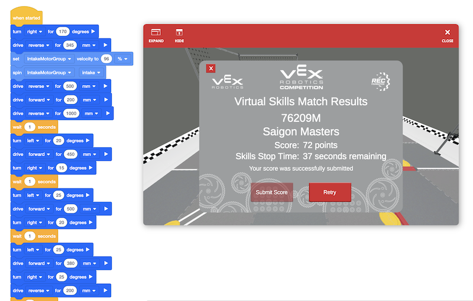
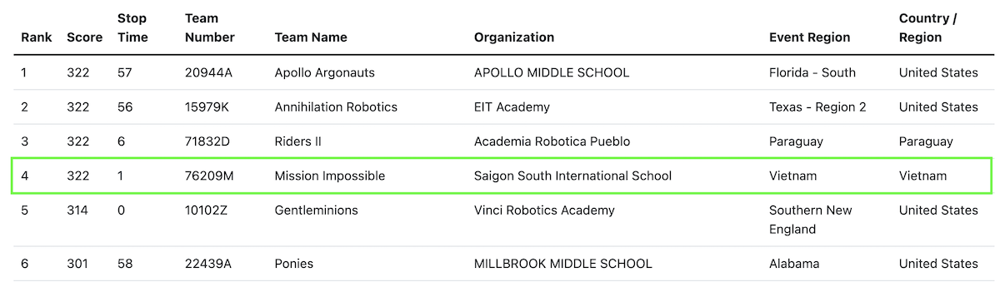

# 2023

SSIS Robotics in the "Spin Up" VEX competition 2022-2023

## Projectile Motion

We added a file [projectile_motion.ipynb](docs/projectile_motion.ipynb) to this repository since we need it for the calculation of our disk path. But you can have a look at it in a [copy in Google Colaboratory](https://colab.research.google.com/drive/1ZDqA7VL2sX8HjGgLV1grBOFcIxxB_T2S?usp=sharing) too.

## Virtual Skills

In November 25, 2022 the current local record for programming is:

Not long after team [76209M](https://www.robotevents.com/teams/VRC/76209M) significantly improved their score:

